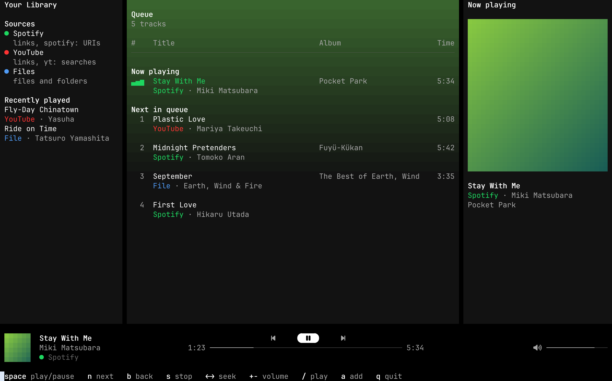
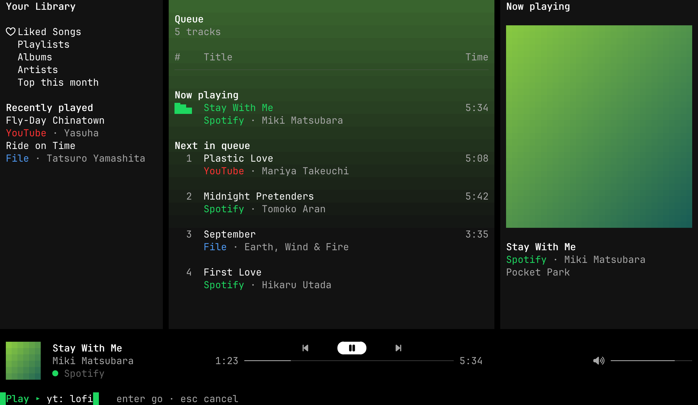

# AgentAmp

A tiny terminal music player for Spotify, YouTube and your own music files,
built to be driven by agents as much as by hands.

- **Rust only, light on purpose.** One binary. It should play smoothly on a
  ten-year-old computer.
- **One queue, three sources.** Spotify (Premium, through
  [librespot](https://github.com/librespot-org/librespot)), YouTube (through
  an installed [yt-dlp](https://github.com/yt-dlp/yt-dlp)), and local MP3,
  FLAC, AAC, Ogg Vorbis and WAV files.
- **Agent native.** Every control is a CLI command with `--json` output and
  a tool of its MCP server, so an agent can act as your DJ.

AgentAmp is an early proof of concept.





Both are the tests' demo frames, rendered by `TERMSHOT_PX=48 scripts/screens.sh` with
[termshot](https://github.com/momiji-rs/termshot). Covers are drawn in half
blocks there; kitty, Ghostty, foot, WezTerm and iTerm2 show the picture.

## Development

```sh
cargo test
scripts/screens.sh   # the TUI tests' frames as PNGs, through termshot
```

TUI changes are checked by looking: `scripts/screens.sh` renders the frames
the tests keep in `target/screens/` with
[termshot](https://github.com/momiji-rs/termshot).

`cargo run --features dev` builds developer mode: F12 or `` ` `` opens an
overlay that switches the spectrum's choices while the music plays (its
scale, fall, peaks, analysis, bar width, frame rate and delay), shows the
frame rate, the time a frame takes and, on Linux, the CPU the window and
its terminal use, and `y` writes the choices to `tuning.txt` next to the
log. Release builds leave all of it out.

Start-up timing, the cost while playing, and what is left to gain:
[docs/performance.md](docs/performance.md).

`Cargo.lock` keeps `vergen` at 9.0.6: librespot-core 0.8's build script does
not compile against vergen 9.1.

CI runs Clippy, with and without developer mode, and the tests on Linux and
macOS for every push to `main` and every pull request.

## Use

`agentamp` alone opens the window: your library, the queue and what is
playing, with the player bar below. Space plays and pauses, `n` skips, `b` goes back, `s`
stops, the arrows seek and set the volume, `/` plays a link, search or
path, `a` adds one, and `q` closes the window while the music keeps going.
The controls use Nerd Font icons, as Omarchy's terminal font has them;
`AGENTAMP_ICONS=plain` keeps to characters any monospace font draws.
Below what is playing, a spectrum analyser draws the sound as the player
hears it, before the volume, so it still moves at volume zero. It redraws
at 60 frames a second while the music plays and stops once its bars have
fallen after a pause.
Covers come from Spotify's image server, YouTube's thumbnails and the
pictures in a file's tags; downloaded ones are kept in
`~/.cache/agentamp/art/`. Terminals that draw images show them sharp:
kitty's graphics protocol (kitty, Ghostty), Sixel (foot) and iTerm2's
(WezTerm, iTerm2). Elsewhere they are drawn in half blocks, which any
terminal with 24-bit colour shows; `AGENTAMP_COVERS=blocks` asks for half
blocks everywhere.
`agentamp tui --frame 120x36` prints one frame as terminal output, for
scripts, agents and screenshots.

```sh
agentamp login                     # once, for Spotify
agentamp play https://open.spotify.com/album/…
agentamp play ~/Music/Album        # a folder, a file, or a link
agentamp play yt: plastic love     # the first YouTube result
agentamp play liked                # your Spotify Liked Songs
agentamp add --next song.flac      # after the current track
agentamp now                       # ▶ Title · Artist  1:23 / 4:29
agentamp --json now                # the same, for scripts and agents
agentamp pause | resume | toggle | next | prev | stop | clear
agentamp queue
agentamp seek 1:30
agentamp volume 40
agentamp quit
```

The first command starts a small background player, which keeps playing
after the terminal closes. It listens on a Unix socket in the runtime
directory (`$XDG_RUNTIME_DIR/agentamp.sock`) that only your user can open.
`now` and `queue` never start it. Its log is `~/.cache/agentamp/agentamp.log`.

The volume goes from 0 to 100 on the same curve for Spotify, YouTube and
files, logarithmic over 60 dB as librespot's is: 50 is 30 dB below full,
and each step sounds the same size. It scales the sound before your system
and your speaker turn it up or down.

Spotify needs a Premium account. `agentamp login` opens Spotify's sign-in
page in the browser and keeps librespot's reusable credential in
`~/.config/agentamp/credentials.json`, in a directory only your user can
read; `agentamp logout` deletes it. Track, album and playlist links and
`spotify:` URIs play, and `liked` plays your Liked Songs. Details for the
first 200 songs of an album or playlist are read ahead; the rest show as
URIs until they play. Spotify audio is never saved as music files: librespot
keeps up to 2 GiB of it in its own encrypted cache
(`~/.cache/agentamp/spotify-audio/`), so songs heard again are not
downloaded again.

YouTube links and `yt:` searches go through the installed `yt-dlp`. AgentAmp
downloads the AAC audio track once into `~/.cache/agentamp/youtube/` and
plays the file from there. It remembers which video each link or search
gave, so asking again plays the kept file without running yt-dlp; a search
keeps its first answer for as long as the file is there. `play` and `add` answer at once: the track waits
in the queue as `downloading` and plays as soon as its file is here.
Downloads go two at a time in play order, so the next track is usually ready
by its turn. A video that cannot be
downloaded leaves the queue, and `now` says why. This is for personal listening; downloading may
breach YouTube's terms. `AGENTAMP_YTDLP` points at another yt-dlp.

`AGENTAMP_HOME=<dir>` keeps every file under one directory, and
`AGENTAMP_AUDIO=null` plays silently while keeping time; the tests use both.

## Agents

`agentamp mcp` is a [Model Context Protocol](https://modelcontextprotocol.io)
server on stdin and stdout, built on the official
[Rust SDK](https://github.com/modelcontextprotocol/rust-sdk). It speaks the
2026-07-28 revision and the older ones with the `initialize` handshake. Its
tools are the CLI's controls: `play`, `add`, `pause`, `resume`, `next`,
`previous`, `stop`, `clear_queue`, `set_volume`, `seek`, `now_playing` and
`queue`. Each answers with the player's state as structured JSON, and a
refusal (a missing file, Spotify without a sign-in) as a tool error the
agent can read. `search_youtube` lists up to 20 videos for a query, with
their title, channel, length and a link to pass to `play` or `add`; it
downloads nothing and leaves out live streams. Like the CLI it starts the
background player when needed; `now_playing`, `queue` and `search_youtube`
never do. It runs no network listener of its own.

```sh
claude mcp add agentamp -- agentamp mcp     # Claude Code
```

Other clients take the same command in their configuration:

```json
{ "mcpServers": { "agentamp": { "command": "agentamp", "args": ["mcp"] } } }
```

Give `play` and `add` absolute paths: a relative one is read from the
directory the client started the server in.
