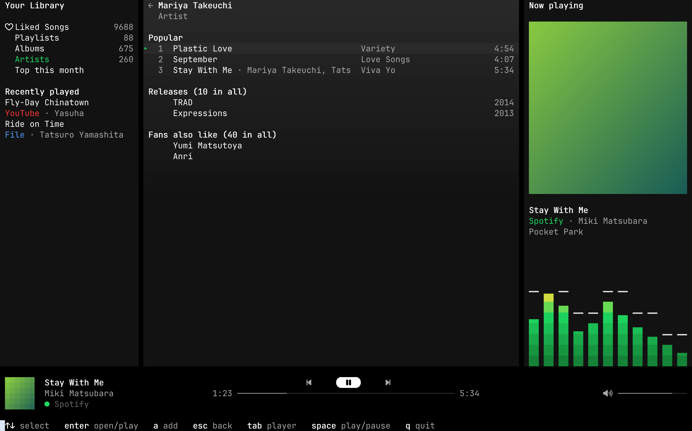

# AgentAmp

A tiny terminal music player for Spotify, YouTube and your own music files,
built to be driven by agents as much as by hands.

- **Rust only, light on purpose.** One binary. It should play smoothly on a
  ten-year-old computer.
- **One queue, three sources.** Spotify (Premium, through
  [librespot](https://github.com/librespot-org/librespot)), YouTube (through
  an installed [yt-dlp](https://github.com/yt-dlp/yt-dlp)), and local MP3,
  FLAC, AAC, Ogg Vorbis and WAV files.
- **Agent native.** Every control is a CLI command with `--json` output and
  a tool of its MCP server, so an agent can act as your DJ.

AgentAmp is an early proof of concept.




All three are the tests' demo frames, rendered by `TERMSHOT_PX=48 scripts/screens.sh` with
[termshot](https://github.com/momiji-rs/termshot). Covers are drawn in half
blocks there; kitty, Ghostty, foot, WezTerm and iTerm2 show the picture.

## Development

```sh
cargo test
scripts/screens.sh   # the TUI tests' frames as PNGs, through termshot
```

TUI changes are checked by looking: `scripts/screens.sh` renders the frames
the tests keep in `target/screens/` with
[termshot](https://github.com/momiji-rs/termshot).

`cargo run --features dev` builds developer mode: F12 or `` ` `` opens an
overlay that switches the spectrum's choices while the music plays (its
scale, fall, peaks, analysis, bar width, frame rate and delay), shows the
frame rate, the time a frame takes and, on Linux, the CPU the window and
its terminal use, and `y` writes the choices to `tuning.txt` next to the
log. Release builds leave all of it out.

Start-up timing, the cost while playing, and what is left to gain:
[docs/performance.md](docs/performance.md).

`Cargo.lock` keeps `vergen` at 9.0.6: librespot-core 0.8's build script does
not compile against vergen 9.1.

CI runs Clippy, with and without developer mode, and the tests on Linux and
macOS for every push to `main` and every pull request.

## Use

`agentamp` alone opens the window: your library, the queue and what is
playing, with the player bar below. Space plays and pauses, `n` skips, `b` goes back, `s`
stops, the arrows seek and set the volume, `/` plays a link, search or
path, `a` adds one, and `q` closes the window while the music keeps going.
Tab moves to the library's shelves (Liked Songs, Playlists, Albums,
Artists, Top this month) and on to the page opened from one, which shows
in the queue's place. There the arrows and Page Up and Down select,
Enter opens an artist, album, playlist or folder and plays a song, `a`
adds what is selected, and Esc goes back a page, then to the queue.
Long pages load 50 items at a time as you scroll. The shelves come from
Spotify with the same queries as `browse`.
The controls use Nerd Font icons, as Omarchy's terminal font has them;
`AGENTAMP_ICONS=plain` keeps to characters any monospace font draws.
Below what is playing, a spectrum analyser draws the sound as the player
hears it, before the volume, so it still moves at volume zero. It redraws
at 60 frames a second while the music plays and stops once its bars have
fallen after a pause.
Covers come from Spotify's image server, YouTube's thumbnails and the
pictures in a file's tags; downloaded ones are kept in
`~/.cache/agentamp/art/`. Terminals that draw images show them sharp:
kitty's graphics protocol (kitty, Ghostty), Sixel (foot) and iTerm2's
(WezTerm, iTerm2). Elsewhere they are drawn in half blocks, which any
terminal with 24-bit colour shows; `AGENTAMP_COVERS=blocks` asks for half
blocks everywhere.
`agentamp tui --frame 120x36` prints one frame as terminal output, for
scripts, agents and screenshots.

```sh
agentamp login                     # once, for Spotify
agentamp play https://open.spotify.com/album/…
agentamp play ~/Music/Album        # a folder, a file, or a link
agentamp play yt: plastic love     # the first YouTube result
agentamp play liked                # your Spotify Liked Songs
agentamp search plastic love       # Spotify tracks, albums, playlists, artists
agentamp browse spotify:artist:…   # popular songs, releases, related artists
agentamp browse playlists          # your playlists; also albums, artists, liked, top
agentamp add --next song.flac      # after the current track
agentamp now                       # ▶ Title · Artist  1:23 / 4:29
agentamp --json now                # the same, for scripts and agents
agentamp pause | resume | toggle | next | prev | stop | clear
agentamp queue
agentamp sync                      # your Liked Songs and their albums, into the database
agentamp import ~/Downloads/my_spotify_data   # your years of plays, from Spotify's export
agentamp sql "SELECT artist, count(*) FROM plays GROUP BY 1 ORDER BY 2 DESC LIMIT 10"
agentamp sql --schema              # what each table and column holds
agentamp seek 1:30
agentamp volume 40
agentamp quit
```

The first command starts a small background player, which keeps playing
after the terminal closes. It listens on a Unix socket in the runtime
directory (`$XDG_RUNTIME_DIR/agentamp.sock`) that only your user can open.
`now` and `queue` never start it. Its log is `~/.cache/agentamp/agentamp.log`.

Each track heard is kept in a SQLite database,
`~/.local/share/agentamp/library.db` (`~/Library/Application Support/agentamp/`
on macOS), in its `plays` table: when it started (UTC), how long it was
heard with pauses left out, its URI or path (a YouTube video's link),
source, title, artist, album and length. A play is written when the next
track takes its place or the player stops. Nothing in it leaves the computer.

`agentamp sync` copies your Spotify Liked Songs into the same database.
The `liked` table has each song's URI, when you liked it (UTC), title,
artists, album, album URI and length. The `albums` table has each of
their albums' title, artists, release date (`2014-09-26`, or `2014-09` or
`2014` when Spotify knows no more), label and kind (`ALBUM`, `SINGLE`,
`EP`, `COMPILATION`). A sync replaces the songs with what Spotify lists
now and says how many are new and gone; it reads only the albums it has
not kept yet, 500 to a request. Ten thousand songs take about 5 seconds.
Spotify gives no genres, so there are none.

`agentamp import` adds the years of plays Spotify keeps. Ask for them on
Spotify's Privacy page, under "Download your data": the Extended streaming
history, which Spotify sends within 30 days as a zip. Unzip it and give
`agentamp import` the folder (or its `Streaming_History_Audio_*.json`
files). Each song heard becomes a row of `plays` with `origin` `spotify`:
its start (when it stopped, less the time heard), time heard, URI, title,
artist and album; its length is 0, as the export does not say. Podcasts,
audiobooks and videos are left out, and so are the IP address, country and
device each play came from. Importing again adds only what is new, and a
play AgentAmp kept itself, within a minute, is not counted twice. The
account data's shorter history (`StreamingHistory_music_*.json`) does
not say which song each play was, so it is refused.

`agentamp sql` asks the database a question in SQL and prints the answer
as a table (`--json` for its columns and rows), reading the question from
stdin when none is given. It opens the file read only, without the
player: a statement that would change anything, a second statement or
another database is refused. `agentamp sql --schema` lists the tables,
what each column holds and how many rows each has. Times are UTC
ISO 8601 text, so `substr(started_at, 1, 7)` is a month, and
`liked.album_uri` joins `albums.uri` for release dates:

```sh
agentamp sql "SELECT substr(a.released, 1, 3) || '0s' AS decade, count(*)
  FROM liked l JOIN albums a ON a.uri = l.album_uri GROUP BY 1 ORDER BY 1"
```

The volume goes from 0 to 100 on the same curve for Spotify, YouTube and
files, logarithmic over 60 dB as librespot's is: 50 is 30 dB below full,
and each step sounds the same size. It scales the sound before your system
and your speaker turn it up or down.

Spotify needs a Premium account. `agentamp login` opens Spotify's sign-in
page in the browser and keeps librespot's reusable credential in
`~/.config/agentamp/credentials.json`, in a directory only your user can
read; `agentamp logout` deletes it. Track, album, playlist and artist
links and `spotify:` URIs play, an artist as Spotify plays them (their
popular songs, then more of their releases), and `liked` plays your Liked
Songs. Details for the first 200 songs of an album or playlist are read
ahead; the rest show as URIs until they play.

`search` lists Spotify's tracks, albums, playlists and artists for a query
(5 of each, `--count` up to 10), each with the URI to play. It asks with
the same sign-in, the way Spotify's web player does, as the Web API's
search turns librespot's client away. The web player's queries are no
public API: each is known by a hash in the web player's code, which
changes with that code. When Spotify refuses a hash, AgentAmp reads the
current code from `open.spotify.com` and `open.spotifycdn.com`, at most
once an hour, and keeps the hashes it finds in
`~/.cache/agentamp/web-player-queries.json`. Should the search still fail,
it falls back to tracks only.

`browse` opens a Spotify page with the same queries: an artist (popular
songs, releases, playlists, fans also like), an album, a playlist or a
folder of playlists, by URI or link; or `playlists`, `albums` and
`artists` from your library, `liked` for Liked Songs, and `top` for this
month's top artists and tracks. Every item ends with the target to play
or browse next. `--count` (20, up to 50) and `--offset` page through the
releases, tracks or library list; each section says how many it has in
all. The queries and their variables are in
[docs/web-player-queries.md](docs/web-player-queries.md).

Spotify audio is never saved as
music files: librespot keeps up to 2 GiB of it in its own encrypted cache
(`~/.cache/agentamp/spotify-audio/`), so songs heard again are not
downloaded again.

YouTube links and `yt:` searches go through the installed `yt-dlp`. AgentAmp
downloads the AAC audio track once into `~/.cache/agentamp/youtube/` and
plays the file from there. It remembers which video each link or search
gave, so asking again plays the kept file without running yt-dlp; a search
keeps its first answer for as long as the file is there. `play` and `add` answer at once: the track waits
in the queue as `downloading` and plays as soon as its file is here.
Downloads go two at a time in play order, so the next track is usually ready
by its turn. A video that cannot be
downloaded leaves the queue, and `now` says why. This is for personal listening; downloading may
breach YouTube's terms. `AGENTAMP_YTDLP` points at another yt-dlp.

`AGENTAMP_HOME=<dir>` keeps every file under one directory, and
`AGENTAMP_AUDIO=null` plays silently while keeping time; the tests use both.

## Agents

`agentamp mcp` is a [Model Context Protocol](https://modelcontextprotocol.io)
server on stdin and stdout, built on the official
[Rust SDK](https://github.com/modelcontextprotocol/rust-sdk). It speaks the
2026-07-28 revision and the older ones with the `initialize` handshake. Its
tools are the CLI's controls: `play`, `add`, `pause`, `resume`, `next`,
`previous`, `stop`, `clear_queue`, `set_volume`, `seek`, `now_playing`,
`queue`, `search_spotify`, `browse`, `sync_library`, `library_schema` and
`query_library`, which do what `search`, `browse`, `sync` and `sql` do. Each answers as structured JSON, the controls with the
player's state, and a refusal (a missing file, Spotify without a sign-in)
as a tool error the agent can read. `queue` lists 20 upcoming tracks
(`count` up to 100, from `offset`) and says how many there are in all, so
a long playlist does not fill the agent's context. `search_youtube` lists up to 20 videos for a query, with
their title, channel, length and a link to pass to `play` or `add`; it
downloads nothing and leaves out live streams. Like the CLI it starts the
background player when needed; `now_playing`, `queue`, `search_youtube`,
`library_schema` and `query_library` never do. `query_library` answers with
100 rows (`rows` up to 1000) and says when more followed, and gives up on
a question after 10 seconds. It runs no network listener of its own.

```sh
claude mcp add agentamp -- agentamp mcp     # Claude Code
```

Other clients take the same command in their configuration:

```json
{ "mcpServers": { "agentamp": { "command": "agentamp", "args": ["mcp"] } } }
```

Give `play` and `add` absolute paths: a relative one is read from the
directory the client started the server in.
